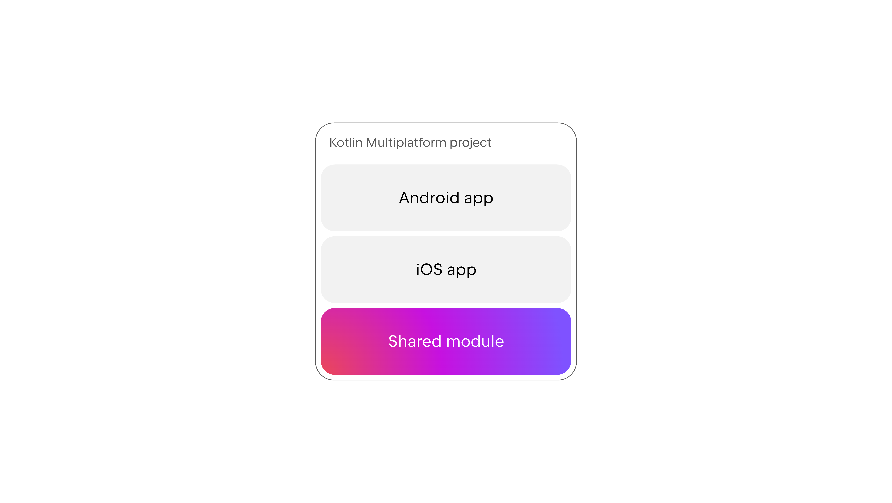
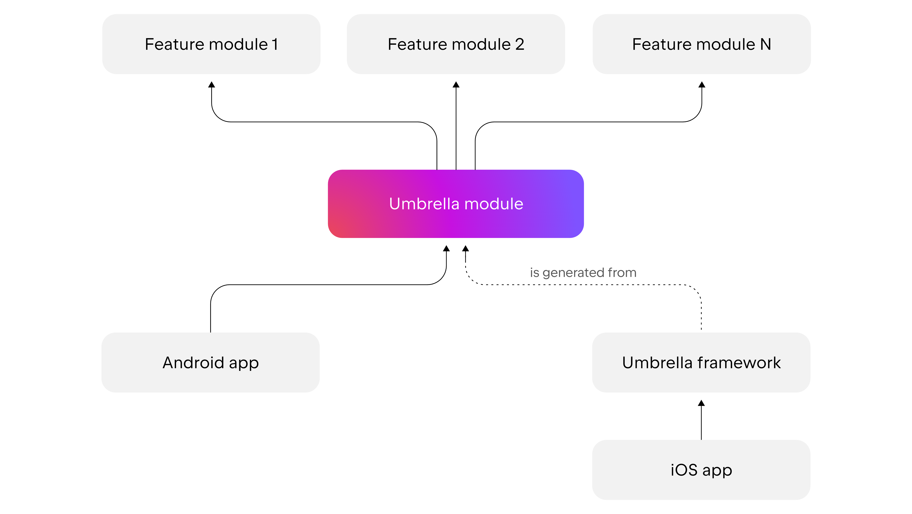

# Weather App

## Table of Contents

- [Overview](#overview)
- [Architecture](#architecture)
- [Project Structure](#project-structure)
- [Tech Stack](#tech-stack)
- [Configuration](#configuration)
- [Getting Started](#getting-started)
  - [Android](#android)
- [Testing](#testing)
- [Roadmap](#roadmap)


## 1. Overview
This project is a modern weather application built to demonstrate **Kotlin Multiplatform (KMP)** in a production-ready context. It leverages a **Native UI** approach (Jetpack Compose for Android, SwiftUI for iOS) while sharing 100% of the business logic, networking, and data persistence in a unified shared layer.

## 2. Architecture: Single Shared Module
For this assignment, I chose a **Monorepo Configuration** with a **Single Shared Module**. This architecture prioritizes development velocity and simplicity while maintaining strict separation of concerns (Clean Architecture).

### The Structure
- `androidApp` — Android entry point and UI (Compose):
  - Screens: `HomeScreen`, `WeatherDetailScreen`
  - Design system and theming utilities
  - `SkySenseApplication` wires Koin with `commonModules()`
- `shared` — KMP library (common, Android, iOS source sets):
  - `network/` Ktor client, `NetworkConfig`, `WeatherApi(Impl)`
  - `domain/` use cases, repository contracts, models
  - `data/` repository implementation, DTOs, mappers
  - `database/` DAO, entities, mappers (Room impl on Android)
  - `presentation/` ViewModels and UI models

<p align="center">
  
</p>
*(Visual representation of the Single Shared Module structure)*

### Why this approach?
* **Single Source of Truth:** All business rules (cachine) live in one place.
* **Zero Logic Duplication:** Both platforms run the exact same binary code for data fetching and storage.
* **Reduced Complexity:** A single module avoids the Gradle configuration overhead associated with multi-module builds, making it ideal for small-to-medium teams or projects of this scale.

---

### Alternative Considered: Feature-Based Modularization
I evaluated splitting the project into multiple feature modules (e.g., `:shared:cities`, `:shared:weatherDetail`, `:shared:core`) but decided against it for this specific deliverable.

<p align="center">
  
</p>
*(Visual representation of the Feature-Based Modularization structure)*

### What it would look like
* **`:shared:core`**: Networking, Database setup, Base classes.
* **`:shared:feature:cities`**: Domain & Data for the list screen.
* **`:shared:feature:details`**: Domain & Data for the detailed view.

### Why I didn't choose it (Trade-off Analysis)
While feature-based modularization is powerful for large teams (50+ engineers), it introduces significant "hidden costs" that would be over-engineering for a two-screen application:

1.  **Build Configuration Overhead**: In KMP, every shared module that includes resources or strict dependencies requires complex Gradle setup to export correctly to the iOS framework (or requires an "Umbrella" module to wrap them).
2.  **Context Switching**: For a small app, hopping between 5 modules to add one field to a specific API endpoint slows down the development loop.

**Verdict:** I opted for **logical separation** (packages) over **physical separation** (modules). The code is structured cleanly enough that extracting it into modules later would be a straightforward refactor if the team grew.

---

## 4. Technology Stack
* **Language/Runtime:** Kotlin Multiplatform, Coroutines, Flow
* **Networking:** Ktor Client, Kotlinx Serialization, Logging
* **DI:** Koin
* **Persistence:** Room (Android)
* **Android UI:** Jetpack Compose
* **Testing:** Kotlin test, Koin test, Ktor test, Coroutines test

## 5. Configuration

SkySense reads API config from BuildKonfig in the `shared` module:

- `BASE_URL` defaults to `https://api.weatherapi.com/v1/`
- `API_KEY` is read from a `local.properties` entry or an environment variable

Set your WeatherAPI key using one of the following:

Add to the project‐root `local.properties` (do not commit this file):
```
WEATHER_API_KEY=YOUR_WEATHER_API_KEY
```
## 6. Getting Started

### Android

Prerequisites:
- Android Studio Koala+ (or newer)
- JDK 17
- Android SDK

Steps:
1. Clone the repository
2. Open the project in Android Studio
3. Ensure `WEATHER_API_KEY` is configured (see [Configuration](#configuration))
4. Select a device/emulator (API 26+)
5. Run the `androidApp` configuration (or Gradle task `:androidApp:installDebug`)

## 7. Testing

Common unit tests live under `shared/src/commonTest`.

From Android Studio/IntelliJ:
- Right‑click the `shared` module tests and Run

Via Gradle:
- Run common tests: `./gradlew :shared:allTests`
- Android unit tests (if any in `androidApp`): `./gradlew :androidApp:testDebugUnitTest`

## Roadmap
- Expand test coverage for ViewModels
- Improve error messages and empty states
- Add UI tests
- Consider exposing a Locations search/autocomplete feature
- Consider using Swipe to refresh functionality
